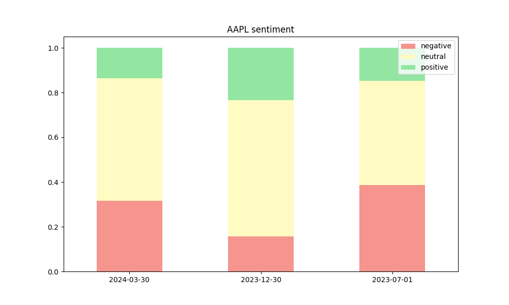
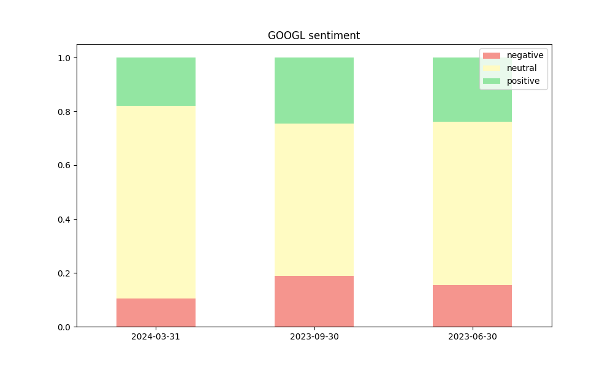
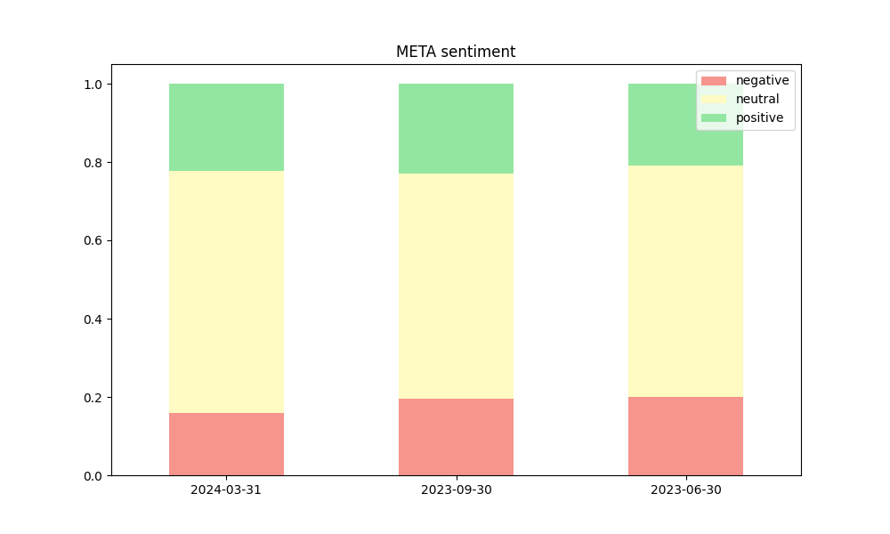
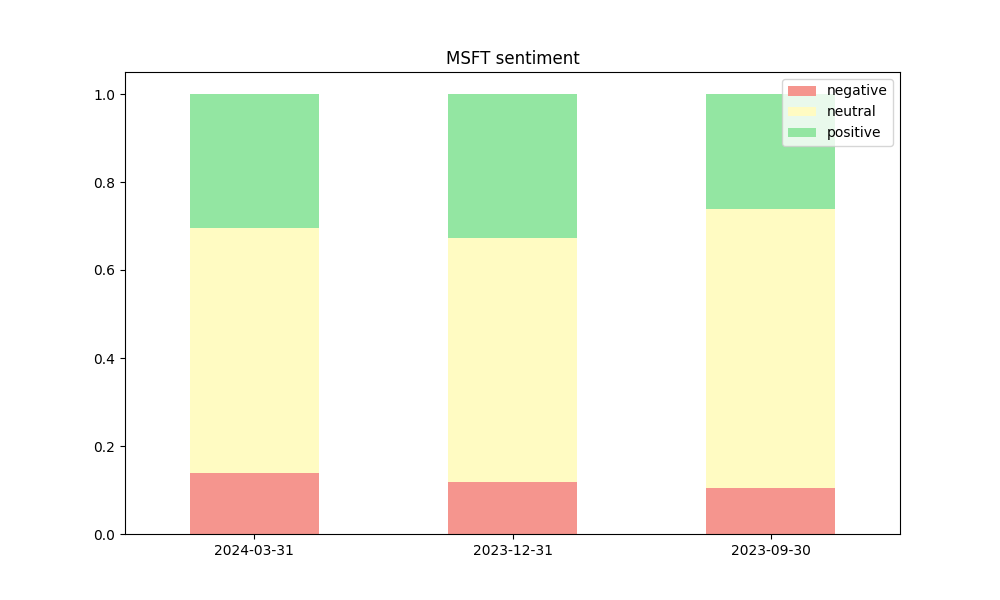
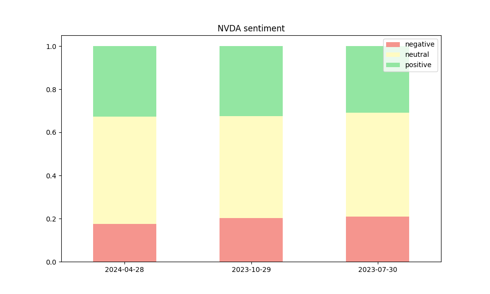
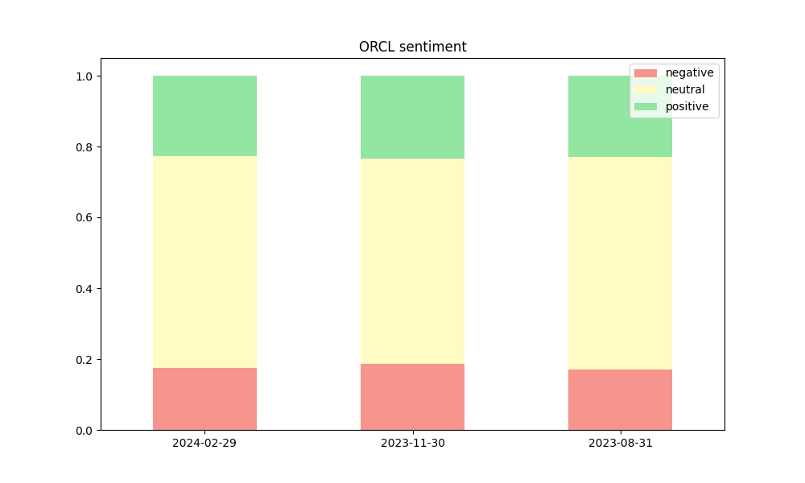

# Scraping SEC filings for Sentiment Analysis
## Installation

SpaCy's sentence chunker needs the following command line:

```python -m spacy download en_core_web_sm```

## Usage

```edgar_func.py``` contains a number of useful functions for getting data from EDGAR.  Some of the functionalities include:

- retrieve and plot a financial attribute (Sales, PPE, etc.) for a given company
- extract the text from the Management Discussion and Analysis for a given 10Q filing
- extract the *n* most recent MD&A texts for a given company


```finbert.ipynb``` uses the functions defined in ```edgar_func.py```, along with a pretrained finbert for sequence classification model to score each sentence in the MD&A sections for the three most recent 10-Q reports.  The graphics below show the proportions of negative, neutral and positive sentences, for each of the six target companies.

### Apple



### Google



### Meta



### Microsoft



### NVIDIA



### Oracle


